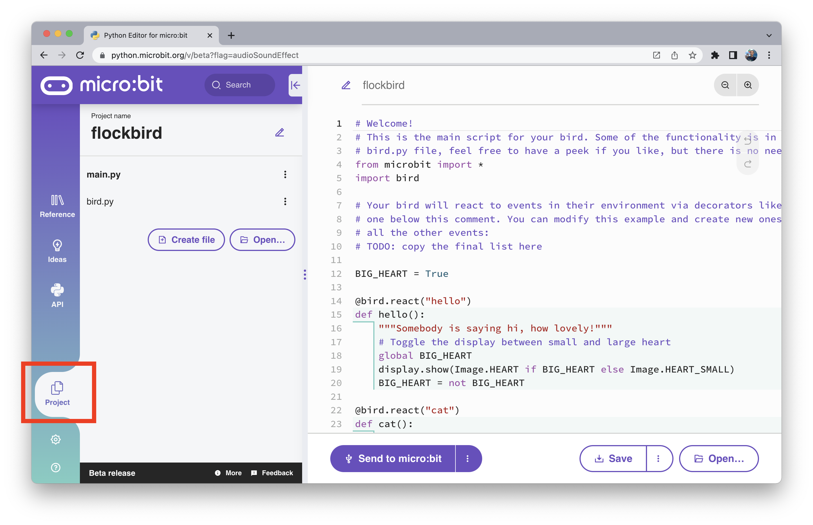

# It's alive

Let's bring our bird alive with code!


## What is all this about?

Your task is to think like a bird and programme the micro:bit to react to the world like a bird.

The micro:bit can communicate wirelessly with other micro:bits using radio.
There will be a secret micro:bit in the room broadcasting radio messages to
all the birds indicating different events like "saying hello" o "there is a cat
around".

Apart from that the micro:bit contains other sensors that your bird will react
to, for example, birds don't like to be shaken!


## First steps - Load the starter project into the editor

Okay, so the first step is to open this link to the Python Editor.
This link contains a flag to enable additional beta features:
[https://python.microbit.org/v/beta?flag=audioSoundEffect](https://python.microbit.org/v/beta?flag=audioSoundEffect)

To start the activity we first need to load a project hex file into the editor
with some starter code.

Right click on this link and select "Save Link As" to save the hex file to your
laptop: [https://github.com/microbit-carlos/microbit-bird-activity/raw/main/src/bird/bin/flockbird.hex](https://github.com/microbit-carlos/microbit-bird-activity/raw/main/src/bird/bin/flockbird.hex)

And then drag and drop the hex file to the Python Editor. The editor might
warn you that this action will replace the project, you can click "Replace" to
accept it.

### So... What am I looking at?

The loaded hex file contains two files, to see them let's go to "Project"
section on the left sidebar:



In this view you can switch between the `main.py` file and the `bird.py`.

- The `bird.py` module contains some functionality for the bird to be able to
react to the world.
- The `main.py` file is the main code we will be working on.

There are some comments in both files that should help clarify what things
are doing, but you can continue with the activity as we look at different
parts in steps.


## Reacting to events

You'll see at the top of `main.py` a function called `hello()` with a decorator
`@bird.react("hello")` on top:

```python
@bird.react("hello")
def hello():
    """Somebody is saying hi, how lovely!"""
    display.show(Image.HEART)
    sleep(400)
```

When the bird detects a hello message from the airwaves, it will run this
function and show a heart image in the micro:bit display for 400 milliseconds.

<p class="exercise">
Exercise: <br>
Birds can be very chatty, so your neighbours might be saying hello quite often.
Can you think of a way to alternate between showing `Image.HEART` and
`Image.HEART_SMALL`? That way it'll look like a beating heart!
</p>

[Solution](https://github.com/microbit-carlos/microbit-bird-activity/tree/main/solutions/1-hello=beating-heart.md)

### What was that! A cat?

There are several events the bird can react to, and seeing a cat is quite important for bird survival.

<p class="exercise">
Exercise: <br>
Let's copy and paste the "hello" example and replace the function name to
`cat()` and change the decorator argument from "hello" to "cat".

What do you think the bird should do in this case?
Some examples of thing you can do can be found in the
<a href="https://microbit-carlos.github.io/microbit-bird-activity/micropython/#quick-things-to-do-with-the-microbit">MicroPython page</a>.
</p>

And at the end of the function we want to warn other birds around us, let's do that adding this line at the end:

```python
bird.warn_about_cat()
```

[Solution](https://github.com/microbit-carlos/microbit-bird-activity/tree/main/solutions/2-cat.md)


## Bird state

```python
while True:
    # Look inside yourself and listen, how is your bird feeling?
    bird_state = bird.current_state()
    if bird_state == "chill":
        display.show(Image.HAPPY)
    sleep(100)
```

<p class="exercise">
Exercise: <br>
Birds don't like to be shaken, so "angry" can also be one of the bird states
to programme.

Let's expand that "if" statement with an "elif" and do something when the bird
is "angry".
</p>

[Solution](https://github.com/microbit-carlos/microbit-bird-activity/tree/main/solutions/3-state-angry.md)


## SoundEffects

Need to explain this.

```python
audio.play(audio.SoundEffect(
    freq_start=400,
    freq_end=2000,
    duration=500,
    vol_start=100,
    vol_end=255,
    wave=audio.SoundEffect.WAVE_TRIANGLE,
    fx=audio.SoundEffect.FX_VIBRATO,
    interpolation=audio.SoundEffect.INTER_LOG
))
```

<p class="exercise">
Exercise: <br>
Can you come up with an "angry" sound for the bird state?
</p>


## TODO

Things that will be included here:
- Quick overview of the micro:bit
- Activity 2: Expand the state (if-else inside `while True`)to react to something
- Explain there are also a new Sound Effect system and provide example
- Activity 3: Create a new sound for any of the reactions/states
- Activity 4: Create a new event or state in bird.py, then react to it in main.py
- What else?
